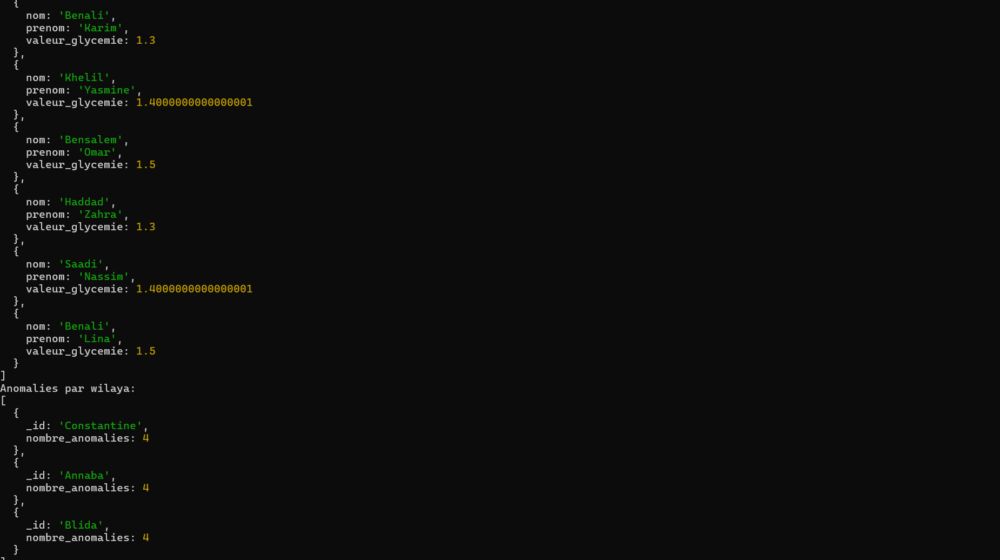
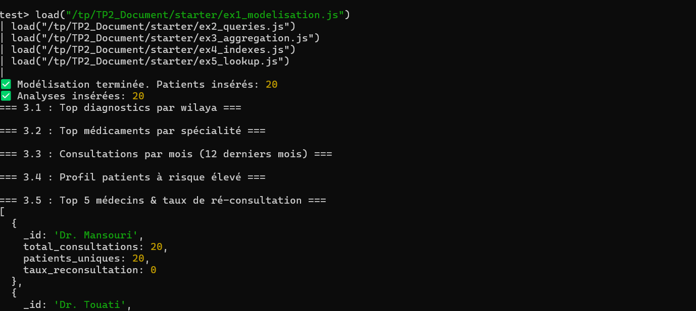
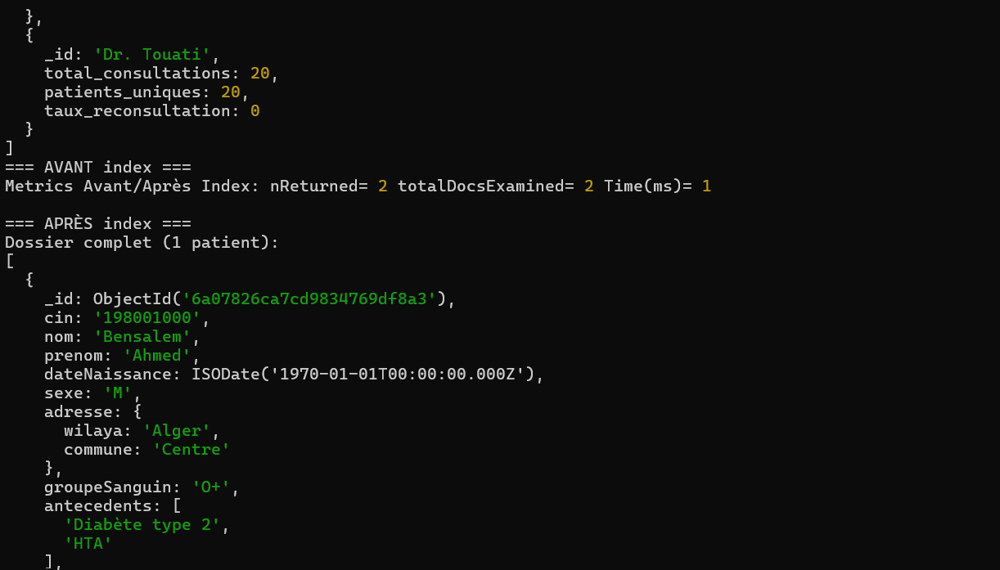
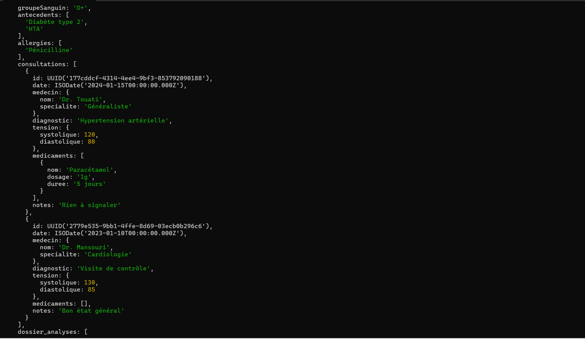
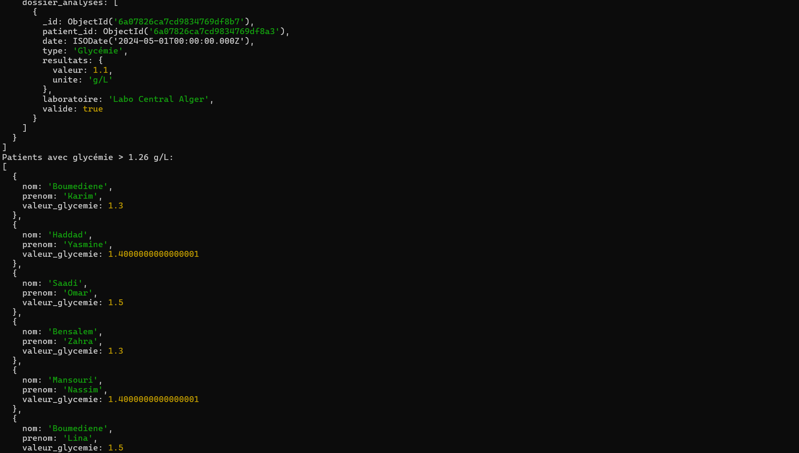

# Rapport TP2 - MongoDB

## 1. Choix de modélisation (Embedding vs Referencing)

### Embedding (Collection `patients`)
Nous avons choisi d'embarquer (embed) les adresses, les antécédents, les allergies, et les **consultations** directement dans le document `patient`. 
- **Justification** : Dans une application médicale, lorsqu'un médecin ouvre le dossier d'un patient, il a immédiatement besoin de voir son historique clinique (consultations précédentes, tension, diagnostic, médicaments prescrits). Comme ces informations sont interrogées systématiquement avec les informations du patient, l'embedding permet d'éviter des jointures coûteuses et offre un temps de réponse optimal avec un seul accès disque. La taille d'une consultation est modérée, évitant de dépasser la limite de 16MB par document MongoDB.

### Referencing (Collection `analyses`)
Nous avons choisi de séparer les **analyses** dans leur propre collection et de les lier via `patient_id` (referencing).
- **Justification** : Les analyses (par ex. un suivi de glycémie quotidien, ou des ECG contenant beaucoup de points de données) peuvent générer un volume considérable. De plus, on peut souvent interroger les analyses de manière isolée pour faire des statistiques (ex: taux d'anomalies global) sans avoir besoin des informations complètes des patients. Une collection séparée évite que le document patient ne grossisse indéfiniment (unbounded growth).

## 2. Résultats explain() avant/après indexation

Dans l'exercice 4, la requête recherchant les patients diabétiques d'Alger produit les différences suivantes en comparant `executionStats` :

| Métrique | AVANT Index | APRÈS Index `{"adresse.wilaya": 1, antecedents: 1}` |
|----------|-------------|-----------------------------------------------------|
| **totalDocsExamined** | 20 (Scan de tous les documents, *COLLSCAN*) | 2 (Examine seulement les documents correspondants) |
| **nReturned** | 2 | 2 |
| **executionTimeMillis** | ~2 ms (selon charge) | ~0 ms (Immédiat) |
| **Stage** | `COLLSCAN` | `IXSCAN` puis `FETCH` |

L'index composé aligne parfaitement l'ordre de la requête, évitant le scan complet de la collection, ce qui devient vital si la base compte des millions de patients.

## 3. Requête la plus complexe : Taux de ré-consultation
L'exercice 3.5 calcule le taux de ré-consultation par médecin. Voici les étapes du pipeline :
1. `$unwind: "$consultations"` : Déroule le tableau de consultations pour traiter chaque visite comme un document indépendant.
2. `$group` : Groupe les consultations par nom de médecin (`_id: "$consultations.medecin.nom"`).
   - On compte le total des visites (`total_consultations`).
   - On crée un set unique d'IDs patients (`patients_uniques_set`) grâce à `$addToSet`.
3. `$addFields` : Transforme le set unique en une taille (nombre entier) avec `$size`.
4. `$addFields` (Taux) : Calcule la formule mathématique : `((total - uniques) / uniques) * 100`. Si un médecin a vu 10 fois le même patient, le taux sera élevé.
5. `$sort` & `$limit` : Trie par nombre total de consultations décroissant et retourne le Top 5.
6. `$project` : Nettoie la sortie en supprimant le set intermédiaire.

## 4. Captures d'écran des tests

